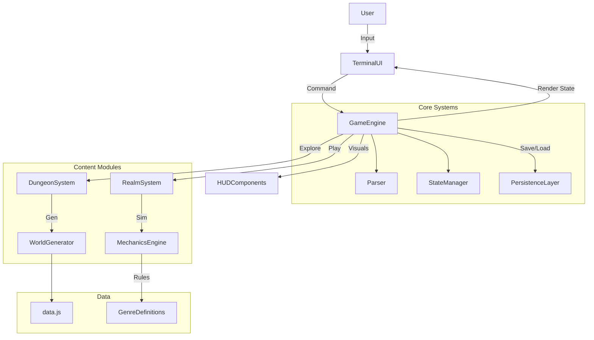

# 02. Technical Design & Architecture

## 1. System Architecture

The application will use a **Feature-Based Architecture** centered around a singleton `GameEngine`. This engine bridges the Svelte UI and the logic systems (Dungeon, Realms, Mechanics).



## 2. Core Data Structures

### 2.1 The Global State (`Store.svelte.js`)

We will use Svelte 5 Runes for reactive state management.

```typescript
// The Single Source of Truth
interface GameState {
    mode: 'DUNGEON' | 'REALM';
    dungeon: DungeonState;
    realm: RealmState | null;
    player: PlayerProfile;
    history: LogEntry[];
    settings: UserSettings;
}

// Reactive Store
export const gameState = $state<GameState>({...});
```

### 2.2 Object Entity Model

Based on `advanced-systems-addendum.md`, objects are complex state machines.

```typescript
class GameObject {
  id: string;
  currentState: string;
  states: Record<string, ObjectState>; // Defined in Addendum

  interact(verb: string, ctx: InteractionContext): InteractionResult {
    // 1. Check current state capability
    // 2. Check conditions (items, relations)
    // 3. Apply transitions
    // 4. Return flavor text & effects
  }
}
```

## 3. Systems Breakdown

### 3.1 The Dungeon System

- **WorldGenerator**: Implementation of the `SeededRandom` algorithms from the PRD.
  - _Input_: Seed (string/number), Platform List.
  - _Process_:
    1.  Generate Zone Graph (nodes = zones).
    2.  Populate Zones with Room Templates.
    3.  Distribute `GameItem` artifacts (70% theme match, 30% noise).
    4.  Lock/Key validation pass (DungeonValidator).
- **NPCManager**: Handles relationship decay and dialogue trees.

### 3.2 The Realm System (Virtual Worlds)

Handles the "Game within a Game" logic (`game-realms-expansion.md`).

- **Strategy Pattern**: `RealmMechanic` interface with implementations for:
  - `PlatformerMechanic` (Jump, Run, Collect)
  - `RPGMechanic` (Turn-based combat, Party)
  - `RacingMechanic` (Lap timer, Boost)
- **Phase Manager**: Handles transitions (e.g., Green Hill Act 1 -> Act 2).

### 3.3 The Parser

- **Tokenization**: Splits input into `Verb`, `DirectObject`, `IndirectObject`.
- **Context Resolution**: "Take it" -> Resolves `it` to the last examined item.
- **Fuzzy Matching**: Levenshtein distance for typos ("Examine Cartrige" -> "Cartridge").

### 3.4 Persistence

- **Adapter**: `IndexedDB` wrapper (via `idb-keyval` or similar). LocalStorage is too small for the complex world state.
- **Auto-save**: Triggered on every `GameState` mutation (debounced 500ms).

## 4. UI Component Structure

### `TerminalLayer.svelte`

- Full-screen overlay.
- **Canvas/CRT Effect**: CSS animations for scanlines and curvature.
- **Input**: Auto-focusing hidden text input, simulating a prompt.

### `OutputRenderer.svelte`

- Renders the `history` array.
- **Rich Text**: Supports specific directives for colored keywords (e.g., `[[Item:Red]]`, `[[NPC:Blue]]`).
- **TypingEffect**: Deferred rendering of characters for immersion.

### `HeadsUpDisplay.svelte`

- Dynamic sidebar/header based on `gameState.mode`.
- **Dungeon Mode**: Inventory, Compass, Room Name.
- **Realm Mode**: Specialized HUDs (Health bars, Lap timers).

## 5. Technology Stack Extensions

- **Natural Language Processing**: Simple rules-based NLP for now (Verb-Noun pairs). LLM calls (`LLMService`) used _only_ for flavor text generation ("Look at room") to allow offline playability for core mechanics.
- **Audio**: WebAudio API for procedural beeps/boops and typing sounds.

## 6. Implementation Phases (Roadmap)

1.  **Engine Core**: State manager, basic Parser, and Terminal UI.
2.  **Dungeon Gen**: Seeded generation of rooms and connectivity.
3.  **Interaction Layer**: Object state machines and basic Item system.
4.  **Content Integration**: Mapping the `data.js` games into the dungeon.
5.  **Realms Alpha**: Implement "Platformer" mechanic as a proof of concept.
6.  **Advanced Systems**: NPC Relationships and LLM flavor text hookup.
